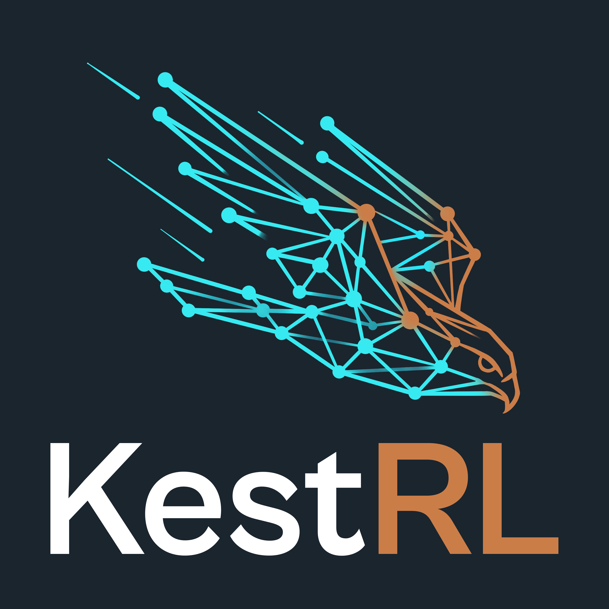
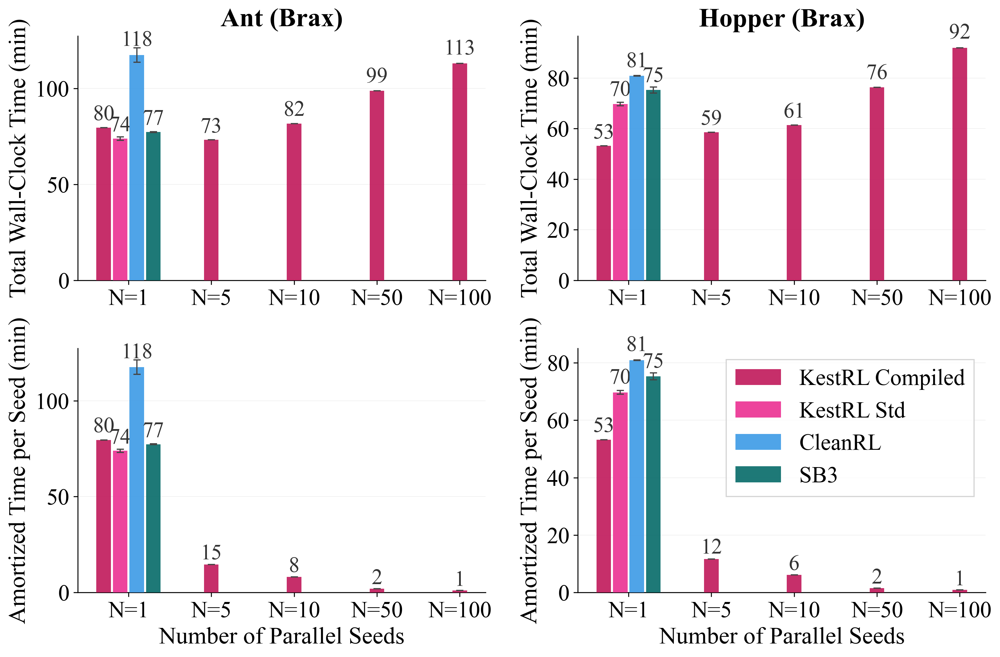
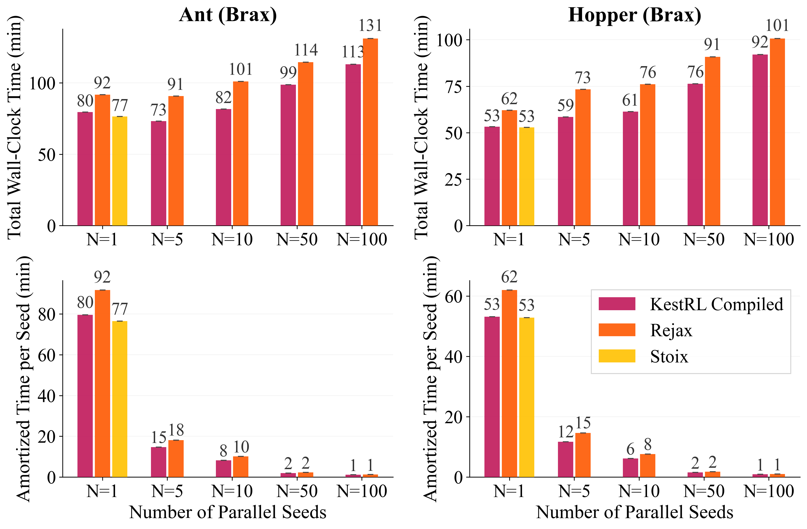
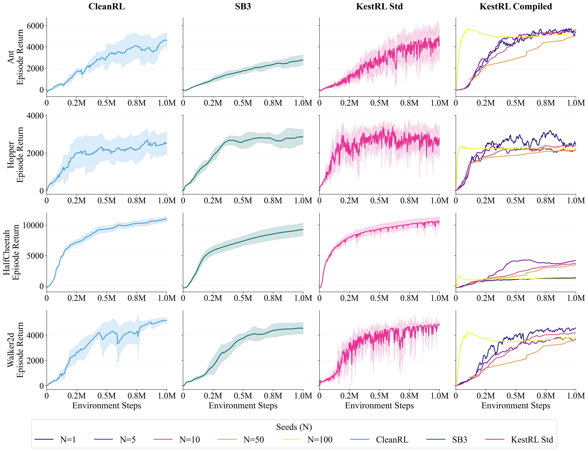
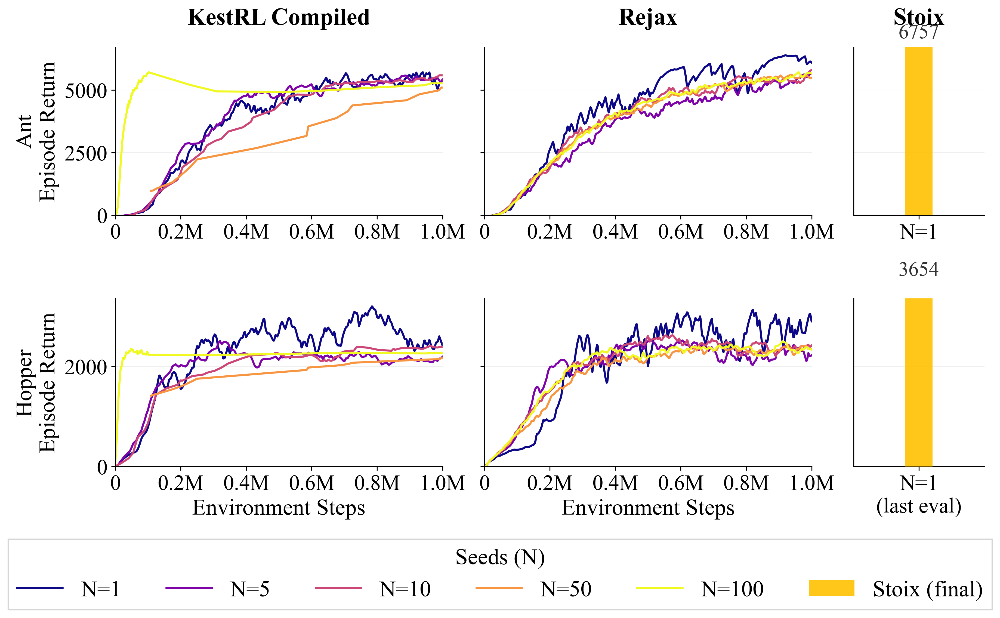

<div style="display: flex; align-items: center">
<div style="flex-shrink: 0.5; min-width: 30px; max-width: 150px; aspect-ratio: 1; margin-right: 15px">
  </img>
</div>
<div>
  <h1>
    KestRL (Kestrel)
    <br>
    <span style="font-size: large">JAX/Flax Reinforcement Learning: clean implementations, hardware-accelerated training.</span>
    <br>
    <a href="https://github.com/adidi24/KestRL/actions/workflows/test.yml">
      
    </a>
    <a href="https://opensource.org/licenses/Apache-2.0">
      
    </a>
    <a href="https://github.com/adidi24/KestRL">
      
    </a>
    <a href="https://github.com/google/jax">
      
    </a>
  </h1>
</div>
</div>
<br>

KestRL is a JAX/Flax reinforcement learning library built around one idea: gradient updates should never wait on Python. It is designed for clean algorithm implementations, reproducible research, and easy extension.

Networks are defined with Flax NNX — full OOP, readable, composable. Before training starts, the entire model bundle is split into a static graph definition and a mutable state PyTree **exactly once**. The graph definition is captured in a closure; only the state flows in and out of JIT. The result is zero retracing, zero Python overhead per gradient step.

For Brax and MJX environments, this extends further: the rollout, buffer write, gradient update, and soft target update all fold into a single `lax.scan` kernel. Multi-seed training becomes `jax.vmap` over independent carries — multiple seeds run in one dispatch, with one host sync per epoch for logging.

---

## Results

**Wall-clock time for 1 M environment steps — Standard Route vs eager baselines (left) and Compiled Route vs functional frameworks (right):**

<p align="center">
  
  
</p>

- **Standard Route** outperforms CleanRL and SB3 on CPU-stepped Gymnasium environments.
- **Compiled Route** outperforms Rejax and matches Stoix on Brax across all seed counts.
- Scaling from N=1 to N=100 parallel seeds costs only ~40 extra minutes total: **80–88× amortized speedup** over sequential baselines.

**Learning curves — algorithmic integrity across seeds:**

<p align="center">
  
  
</p>

KestRL Standard tracks CleanRL and SB3 precisely; KestRL Compiled mirrors Rejax and Stoix. Multi-seed vectorization introduces no algorithmic drift.

---

## Library comparison

| Library | Backend | Gymnasium | JIT updates | Full compile | Multi-seed vmap | OOP design |
|---|---|:---:|:---:|:---:|:---:|:---:|
| Stable-Baselines3 | PyTorch | ✅ | ❌ | ❌ | ❌ | ~ |
| CleanRL | PyTorch | ✅ | ❌ | ❌ | ❌ | ❌ |
| TorchRL | PyTorch | ✅ | ❌ | ❌ | ❌ | ✅ |
| Garage | PyTorch/TF | ~ | ❌ | ❌ | ❌ | ~ |
| PureJaxRL | JAX | ⚠️ | ✅ | ✅ | ✅ | ❌ |
| Rejax | JAX | ⚠️ | ✅ | ✅ | ✅ | ❌ |
| Stoix | JAX | ⚠️ | ✅ | ✅ | ✅ | ❌ |
| **KestRL Standard** | **JAX** | **✅** | **✅** | **❌** | **❌** | **✅** |
| **KestRL Compiled** | **JAX** | **⚠️** | **✅** | **✅** | **✅** | **~** |

⚠️ Requires a JAX-native environment ([Brax](https://github.com/google/brax), [MJX](https://github.com/google-deepmind/mujoco/tree/main/mjx), [Gymnax](https://github.com/RobertTLange/gymnax), [Jumanji](https://github.com/instadeepai/jumanji), …).  
~ Partial support.

KestRL is the only JAX library that supports standard Gymnasium environments with JIT-compiled updates **and** full on-device compilation with multi-seed vmap.

---

## Two routes

### Standard Route (Gymnasium)

Standard Gymnasium environments, NumPy replay buffer, JIT-compiled gradient updates. The `env.step` crosses Python; everything else stays on-device.

```python
agent = SAC(env, algo_cfg, seed=0)
trainer = Trainer(agent, config, writer=writer)
trainer.train()
```

### Compiled Route (Brax, MJX)

Entire training loop on-device — rollout, buffer write, gradient update, soft target update — all in one `lax.scan` kernel.

```python
trainer = CompiledTrainer(env, config, writer=writer)
trainer.train(seed=0)                           # single seed, live progress
trainer.train_seeds_live(num_seeds=100, seed=0) # 100 seeds, vmapped epochs
```

Under the hood, both routes share the same Frozen-Bundle Pattern:

```python
# define with NNX — readable, standard OOP
self.actor  = MultiHeadMLP(obs_dim, head_configs, hidden_dims, rngs=rngs)
self.critic = MLP(critic_in, 1, hidden_dims, rngs=rngs)

# split exactly once before training
bundle_gd, bundle_state = nnx.split(bundle)

# compile a pure update — bundle_gd is captured, never re-traced
self._jit_update = _make_frozen_update(bundle_gd, ...)

# each step: only flat state crosses the JIT boundary
bundle_state, metrics = self._jit_update(bundle_state, batch, key)
```

In the Compiled Route, `bundle_state` becomes a field in the `lax.scan` carry. Same pattern, wider scope.

---

## PB-SAC

KestRL ships a full implementation of **PB-SAC** (Posterior Bootstrap SAC), a PAC-Bayes actor-critic method. PB-SAC maintains a block-diagonal low-rank posterior over the actor weights, optimises a PAC-Bayes bound to certify policy performance, and uses posterior-guided exploration during a critic-recalibration phase. Both Standard and Compiled routes are supported.

KestRL was the experimental platform for the paper introducing PB-SAC, accepted at **ICML 2026**: [arxiv.org/abs/2510.10544](https://arxiv.org/abs/2510.10544).

---

## Algorithms

| Algorithm | Discrete | Continuous | Standard Route | Compiled Route |
|---|:---:|:---:|:---:|:---:|
| SAC | ✅ | ✅ | ✅ | ✅ |
| PB-SAC | ✅ | ✅ | ✅ | ✅ |
| PPO | ✅ | ✅ | Planned | Planned |
| DQN | ✅ | ❌ | Planned | Planned |

---

## Installation

```bash
git clone https://github.com/adidi24/KestRL.git
cd KestRL
uv sync
```

Python 3.10–3.12. Ships with the JAX CPU backend; swap in `jax[cuda12]` or `jax[tpu]` for accelerators.

## Quick start

```bash
# SAC on HalfCheetah-v5
uv run python -m kestrl.experiments.run

# SAC on CartPole-v1 (discrete)
uv run python -m kestrl.experiments.run algorithm=sac_cartpole environment=cartpole

# Compiled SAC on Brax Ant, 4 seeds
uv run python -m kestrl.experiments.run environment=brax algorithm=sac_mujoco experiment.num_seeds=4

# W&B tracking
uv run python -m kestrl.experiments.run experiment.track=true
```

Configuration via [Hydra](https://hydra.cc), config groups under `src/kestrl/configs/`.

---

## Frozen-Bundle micro-benchmark

The **Frozen-Bundle Pattern** eliminates `@nnx.jit` graph-traversal overhead by splitting the algorithm state once before training. The `GraphDef` is captured in compiled closures; only the flat state PyTree crosses the JIT boundary at each step.

**Single-step boundary overhead (H100, synchronous):**

| Approach | Single step (μs) | Speedup |
|---|---:|---:|
| `@nnx.jit` | 2616.7 | 1.00× |
| `nnx.jit(graph=False)` | 1310.3 | 2.00× |
| **Frozen-Bundle (KestRL)** | **958.9** | **2.73×** |
| `nnx.cached_partial`* | 826.0 | 3.17× |

**Loop scaling — total time for K steps (ms):**

| Approach | K = 10 | K = 100 | K = 1 000 |
|---|---:|---:|---:|
| `@nnx.jit` (Python loop) | 24.96 | 249.87 | 2 443.43 |
| `nnx.cached_partial` (Python loop) | 8.20 | 80.47 | 796.74 |
| **Frozen-Bundle (`lax.scan`)** | **1.97** | **10.89** | **85.74** |

`nnx.cached_partial` is marginally faster per isolated step but mutates state via Python-side references, breaking `lax.scan` and `jax.vmap` compatibility. The Frozen-Bundle drops 1 000-step loop overhead from 2.4 s to 86 ms — a **28× reduction**.

---

## Alternatives

**JAX**

- [rejax](https://github.com/keraJLi/rejax) — same compiled-training idea, broader algorithm coverage, requires JAX-native environments
- [PureJaxRL](https://github.com/luchris429/purejaxrl) — where the end-to-end JAX training idea started, single-file and easy to read
- [Stoix](https://github.com/EdanToledo/Stoix) — distributed actor-learner at scale, TPU/GPU clusters

**PyTorch**

- [CleanRL](https://github.com/vwxyzjn/cleanrl) — single-file implementations, the best place to read how an algorithm actually works
- [Stable-Baselines3](https://github.com/DLR-RM/stable-baselines3) — the production standard
- [ObjectRL](https://github.com/adinlab/objectrl) — object-oriented PyTorch RL library with a focus on modularity and clean architecture

---

## Status & Roadmap

KestRL is currently solo-built and maintained. Contributions and feedback are welcome.

No public community is available yet. If you're interested in joining the private Discord server, reach out on [X (@zitouniabdelkr1)](https://x.com/zitouniabdelkr1) or [LinkedIn (Abdelkrim ZITOUNI)](https://www.linkedin.com/in/abdelkrim-zitouni/).

Planned:

- **More algorithms** — PPO, DQN
- **Documentation** — full API reference and tutorials
- **Contributing guide** — structured onboarding for contributors

---

## License

Apache 2.0
